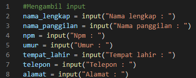
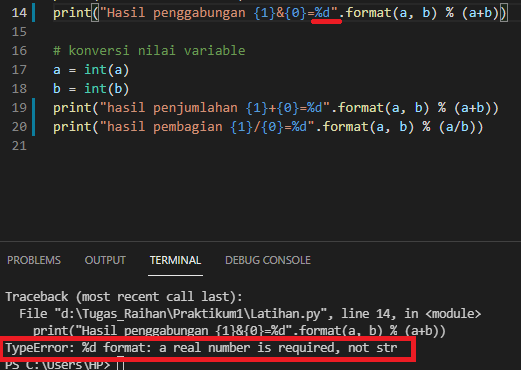

# Praktikum1
## Tugas Pertemuan 5 - Bahasa Pemrograman

### 1. Penjelasan file Tugaslatihan.py
* **Mengambil input:**
```nama_lengkap = input("Nama lengkap : ")
   nama_panggilan = input("Nama panggilan : ")
   npm = input("Npm : ")
   umur = input("Umur : ")
   tempat_lahir = input("Tempat lahir : ")
   telepon = input("Telepon : ")
   alamat = input("Alamat : ")
```

* **Konversi nilai variabel:**
```
  txt = "Assalamu'alaikum.\n\nLet me introduce my self. My name is {}, but you can call me {}. My NPM is {}. I was born in {} and I am {} years old. I am very glad if you want to invite my house in {}. So, don't forget to call me before with the number {}.\n\nThank you."
  ```

* **Menampilkan Output:**
```
  print(txt.format(nama_lengkap, nama_panggilan,npm, tempat_lahir, umur, alamat, telepon)) 
```
* **Screnshoot output program:**


### 1. Penjelasan file Latihan.py

* **Screenshoot Output**


Bisa diliat pada gambar di atas, hasil output program tersbut terdapat error dikarenakan: 
- terdapat "TypeError: %d format: a real number is required, not str" (program menolak dikarekan bertipe %d)
- sedangkan pada program tersebut adalah berinput variable (a,b) bertipe string, maka seharusnya menggunakan tipe $s
- 

